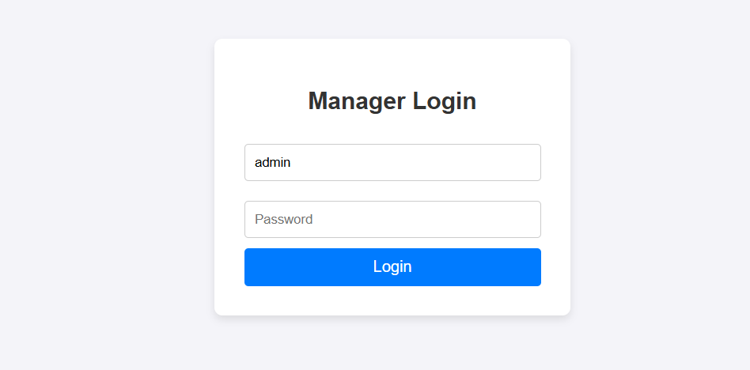
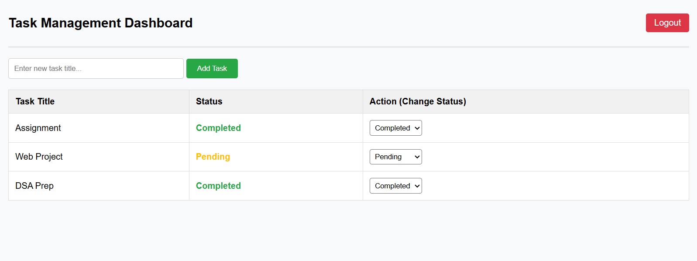

# Task Manager Project

A simple Task Management Web Application built using Python (Flask), MySQL, and HTML/CSS/JS.

---

## 🚀 Features
- **Secure Manager/Admin Login Only**: Access control restricted strictly to administrators (No registration).
- **Task Creation**: Dynamically add new tasks with a custom title field.
- **Status Update**: Manage workflow states easily via an interactive dropdown (`Pending` / `Completed`).
- **Session Control**: Simple logout mechanism to secure the dashboard session.

---

## 📸 Screenshots

### 1. Manager Login Portal

### 2. Task Management Dashboard

---

## 🛠️ Tech Stack
* **Frontend:** HTML5, CSS3, JavaScript
* **Backend:** Python 3.x, Flask
* **Database:** MySQL

---

## 🔐 Default Credentials

To access the dashboard, use the following administrator credentials:

| Field | Default Value |
| :--- | :--- |
| **Username** | `admin` |
| **Password** | `admin_password` |

---

## How to Run the Project
1. **Database Setup**: 
   - Open MySQL Client and create a database named `task_manager_db`.
   - Run the tables script to create `manager_login` and `tasks` tables.
   - Default login: Username: `admin` | Password: `admin_password`
2. **Install Dependencies**: `pip install flask mysql-connector-python`
3. **Run Application**: Execute `python ap.py`
4. **Access Link**: Open `http://127.0.0.1:5000/` in your browser.